# 👋 Olá, eu sou o Adair
---

### 📝 Sobre Mim
Estudante de Ciência da Computação no IF Goiano. Enxergo a programação como uma ferramenta poderosa onde posso soltar a minha criatividade e resolver problemas. 

---

### 🎯 Atualmente focado em:
* 🛠️ Ser nível júnior em uma linguagem de programação.
* 📂 Evoluir e organizar meu portfólio.
* 🧠 Fortalecer minha base em algoritmos e estrutura de dados.

---

### 💻 Linguagens: 

   
   
  

---

### 🛠️ Ferramentas: 

  
  
  
  
  

---

### 👤 Redes Sociais:

  
  

---

### 📊 Estatísticas do GitHub:

  

---

  <i>"Se você quer fazer do mundo um lugar melhor, olhe para si mesmo e faça a mudança."</i>  
  — <b>Michael Jackson</b>

